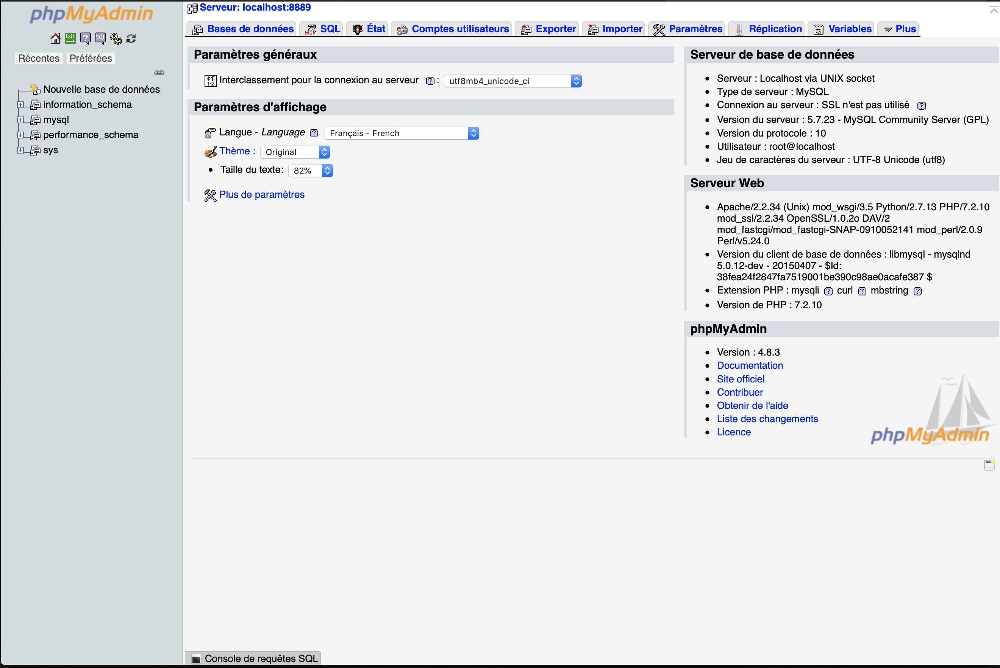
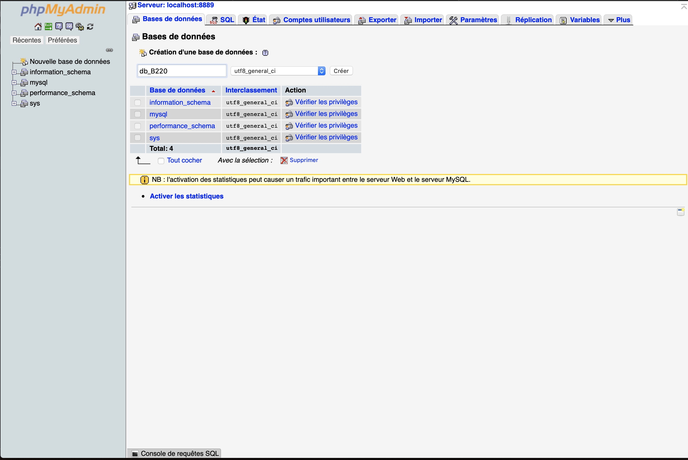
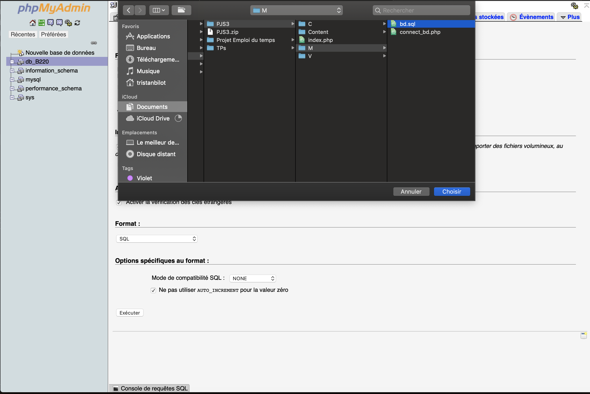
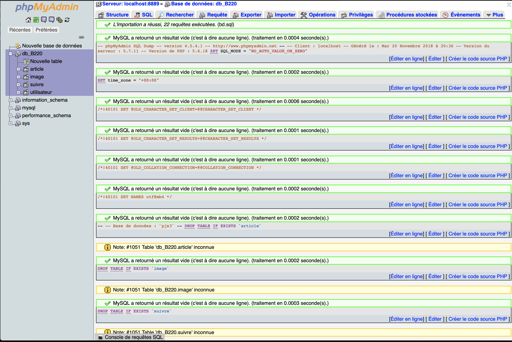
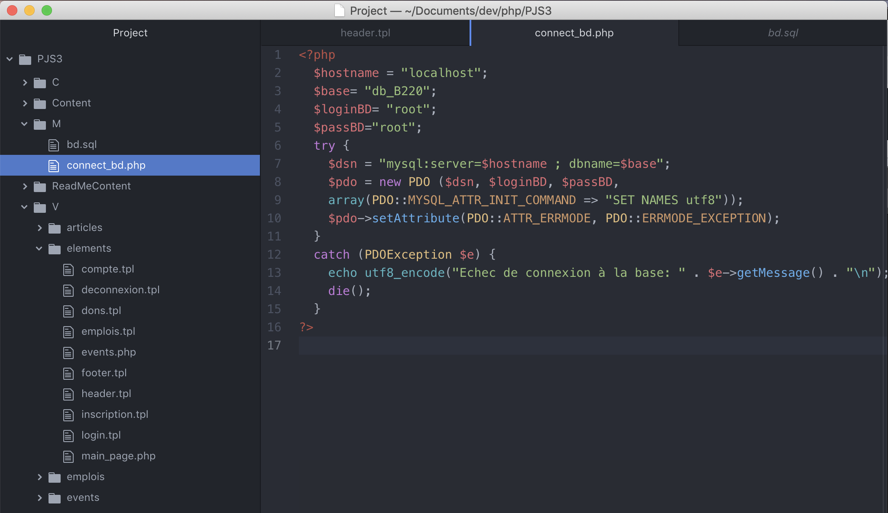
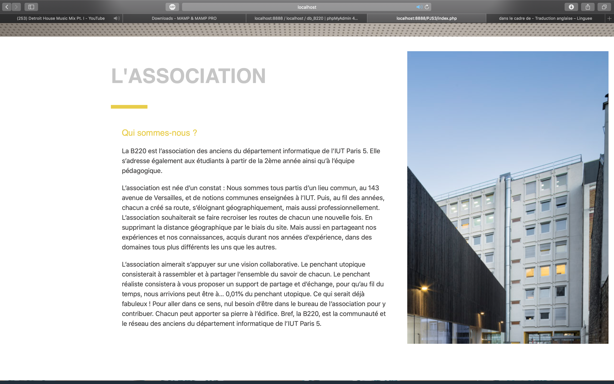
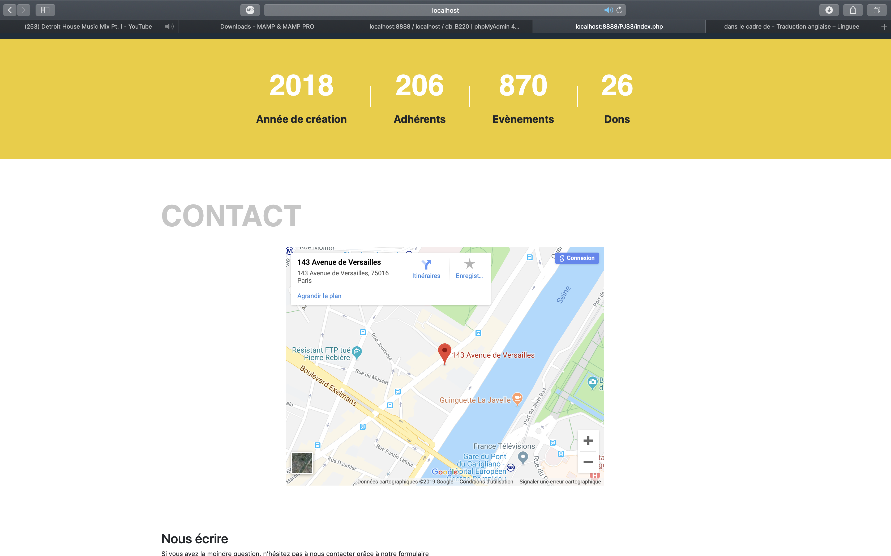
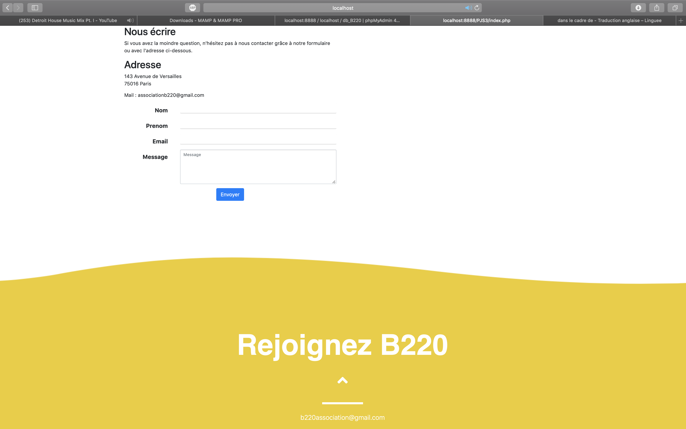
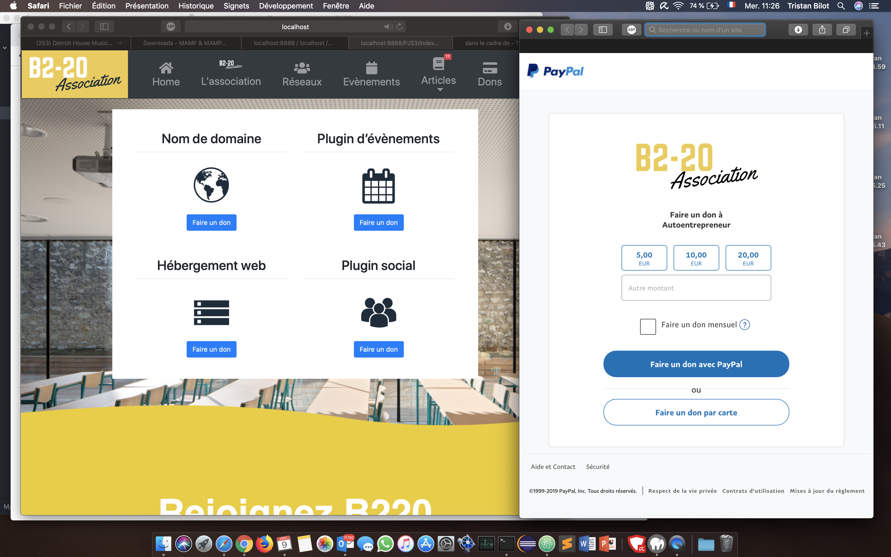

# Website-for-an-Association
Made in 2018: This is the website I made with my team as part of the Junior Entreprise of my Technology Institute. 

<h2>Installation of the MySQL Database</h2>
<h3>1. Create a new database</h3>

<h3>2. Put the name you want</h3>

<h3>3. Import the sql file to the database</h3>

<h3>4. Change the name of your database with $base = 'new name'</h3>

<h3>5. Run index.php with your server and enjoy !</h3>

